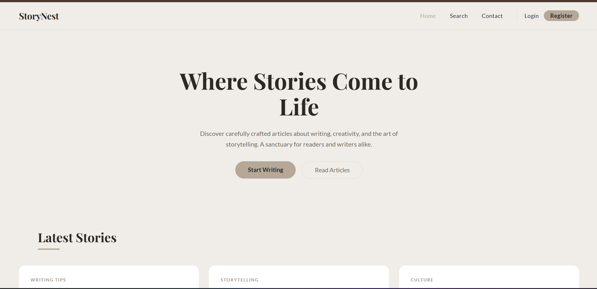
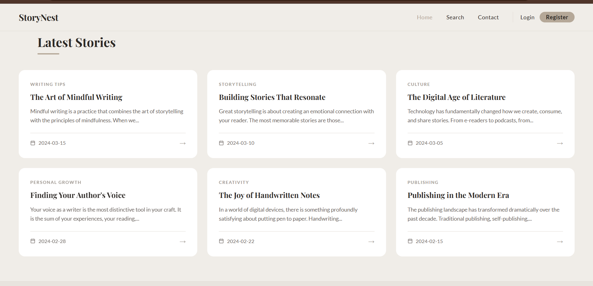
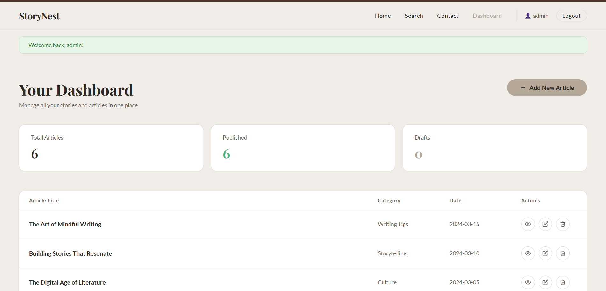

# 📖 StoryNest – Your Personal Blogging Haven

A clean, minimal personal blogging platform built with **Python Flask** where writers can publish stories and readers can discover them.


---

## ✨ Features

- 📝 **Write & Publish** articles with title, category, date and content
- 👥 **Multi-user** support — every writer has their own dashboard
- 🔐 **Authentication** — Register, Login, Logout with hashed passwords
- 📋 **Draft / Published** status for articles
- 🔍 **Search** articles by title, category or content
- 📬 **Contact Form** — visitors can send messages
- 📱 **Fully Responsive** — works on mobile, tablet and desktop
- 🗄️ **SQLite Database** with SQLAlchemy ORM

---

## 🖥️ Pages

| Page | URL | Access |
|------|-----|--------|
| Home | `/` | Public |
| Article Detail | `/article/<id>` | Public |
| Search | `/search` | Public |
| Contact | `/contact` | Public |
| Register | `/register` | Public |
| Login | `/login` | Public |
| Dashboard | `/dashboard` | Login Required |
| Add Article | `/admin/add` | Login Required |
| Edit Article | `/admin/edit/<id>` | Login Required |

---

## 🛠️ Tech Stack

| Layer | Technology |
|-------|------------|
| Backend | Python, Flask |
| Database | SQLite, SQLAlchemy |
| Auth | Flask-Login, Flask-Bcrypt |
| Frontend | HTML5, CSS3, Jinja2 |
| Fonts | Playfair Display, Lato |

---

## 🚀 Getting Started

### 1. Clone the Repository
```bash
git clone https://github.com/YOURUSERNAME/StoryNest.git
cd StoryNest
```

### 2. Create a Virtual Environment (recommended)
```bash
python -m venv venv

# Windows
venv\Scripts\activate

# Mac/Linux
source venv/bin/activate
```

### 3. Install Dependencies
```bash
pip install -r requirements.txt
```

### 4. Run the App
```bash
python app.py
```

### 5. Open in Browser
```
http://127.0.0.1:5000
```

---

## 🔑 Default Admin Credentials

```
Username : admin
Password : admin123
```

> ⚠️ Change these credentials after your first login in production.

---

## 📁 Folder Structure

```
StoryNest/
│
├── app.py                  # Main Flask application
├── models.py               # Database models
├── requirements.txt        # Dependencies
├── README.md               # This file
│
├── images/
│   ├── home.png
│   ├── latest_stories.png
│   ├── dashboard.png
│   └── contact.png
│
├── templates/
│   ├── base.html           # Shared navbar + footer
│   ├── home.html           # Home page
│   ├── article.html        # Article detail
│   ├── contact.html        # Contact form
│   ├── search.html         # Search results
│   ├── login.html          # Login page
│   ├── register.html       # Register page
│   ├── dashboard.html      # Admin dashboard
│   ├── add_article.html    # Add article form
│   └── edit_article.html   # Edit article form
│
└── static/
    └── css/
        └── style.css       # All styles
```

---

## 📸 Screenshots

### Home Page


### Latest Stories


### Dashboard


### Contact


---

## 🔮 Future Enhancements

- [ ] Rich text editor (TinyMCE / Quill)
- [ ] Image upload for articles
- [ ] Comment system
- [ ] Tag/Category filtering
- [ ] Pagination
- [ ] Email notifications
- [ ] Deploy to Render / Railway

---

## 👩‍💻 Author

**Jenisha Varde**

---

## 📄 License

This project is licensed under the MIT License.
